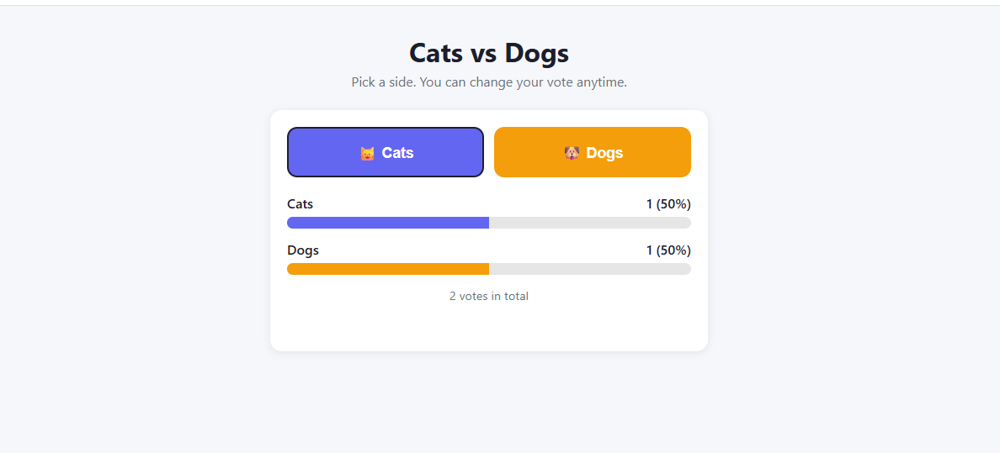
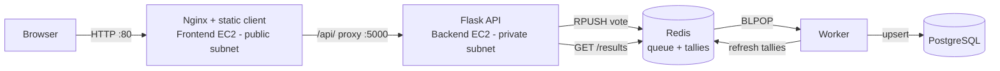
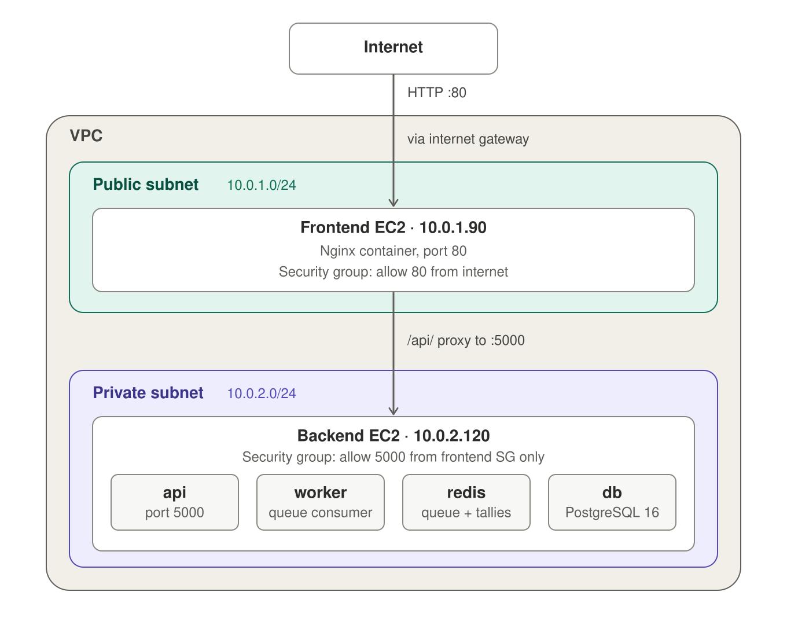

# Cats vs Dogs: Two-Tier Voting App on AWS

A voting app with a queue-based backend, deployed across two EC2 instances with Docker Compose.



## Architecture



## How it works

1. The browser sends `POST /api/vote` with a `voter_id` and a `choice`.
2. The API validates the request, pushes it onto a Redis list, and returns `202 Accepted`.
3. The worker pops the vote and upserts it into PostgreSQL (one row per voter, so changing your vote replaces the old one).
4. The worker rebuilds the tallies in a Redis hash from Postgres, and `GET /api/results` serves them.

## API

| Method | Path | Description |
|---|---|---|
| POST | `/vote` | Queue a vote (`{"voter_id": "...", "choice": "cats" or "dogs"}`), returns 202 |
| GET | `/results` | Current tallies, e.g. `{"cats": 1, "dogs": 1}` |
| GET | `/health` | Liveness check (pings Redis) |

Through nginx these are reachable under `/api/` (for example `/api/results`).

## Design decisions

- **Asynchronous writes:** the API never touches Postgres, so a slow database can't block voters.
- **Postgres as the source of truth:** Redis tallies are a cache rebuilt from the database, including at worker startup, so a Redis restart doesn't lose results.
- **Resilience:** the worker retries Redis and Postgres connections on startup. If the database connection drops mid-vote, it requeues the vote and reconnects. Malformed messages are logged and dropped.
- **Input validation:** choices are whitelisted, voter IDs are capped at 64 characters, and Redis failures return 503 instead of crashing.
- **Network isolation:** the backend security group accepts port 5000 only from the frontend's security group. Admin access is through SSM Session Manager, with no open SSH port.
- **Secrets out of git:** the Postgres password is read from a gitignored `.env` file. `backend/.env.example` shows the format.
- **Self-healing:** every service uses `restart: unless-stopped`, and Docker is enabled at boot, so the stack recovers after a reboot.

## Tech stack

Python (Flask, psycopg2, redis-py), Redis, PostgreSQL 16, Nginx, Docker Compose, AWS (EC2, VPC, security groups, SSM Session Manager).

## Project structure

```
api/        Flask API
worker/     Queue consumer
client/     Static frontend
backend/    Compose file for the backend instance (api, worker, redis, db)
frontend/   Compose file + nginx.conf for the frontend instance
local/      All-in-one stack for local development
```

## Run locally

```bash
cd local
docker compose up --build
# open http://localhost:8080
```

## Deploy on AWS

**Prerequisites:** two EC2 instances (Amazon Linux 2023) with Docker, Git and the buildx plugin (0.17+) installed. Security groups: frontend allows TCP 80 from the internet; backend allows TCP 5000 from the frontend's security group only.

**1. Backend instance (private subnet)**

```bash
git clone https://github.com/EddyOmoOsas/voting-project.git
cd voting-project/backend
echo "POSTGRES_PASSWORD=$(openssl rand -hex 16)" > .env
chmod 600 .env
sudo docker compose up -d --build
```

**2. Point nginx at the backend**

Edit `frontend/nginx.conf` and set `proxy_pass http://<backend-private-ip>:5000/;`, then commit and push.

**3. Frontend instance (public subnet)**

```bash
git clone https://github.com/EddyOmoOsas/voting-project.git
cd voting-project/frontend
sudo docker compose up -d --build
```

**4. Verify**

```bash
curl -i http://localhost/api/health     # on the frontend: {"status":"ok"}
curl -i http://localhost/api/results    # {"cats":0,"dogs":0}
```

Then open `http://<frontend-public-ip>` and cast a vote.

## Challenges I solved

- Split a single all-in-one Compose file into separate frontend and backend stacks, including fixing an nginx upstream (`api`) that only resolved inside one Compose network.
- Debugged corrupted YAML and nginx config (a stray prefix on line 1 stopped nginx from starting) using container logs and `cat -A`.
- Fixed `compose build requires buildx 0.17.0 or later` on Amazon Linux 2023 by installing the buildx plugin.
- Told a missing listener apart from a security group block by reading "connection refused" (instant) versus a timeout.
- Rotated the database password on a live Postgres volume without losing votes: Postgres reads `POSTGRES_PASSWORD` only on first start, so I ran `ALTER USER` inside the running container before switching the Compose file over.

## Known limitations and next steps

- Replace Flask's development server with gunicorn.
- The worker recomputes tallies with a full `GROUP BY` on every vote. At scale, use incremental counters.
- A vote is lost if the worker crashes after popping it and before saving it. A reliable-queue pattern (`BLMOVE` to a processing list) would fix this.
- No authentication or rate limiting on `/vote`.
- Password is loaded from `.env` on the server; next step is AWS Secrets Manager or SSM Parameter Store.
- Add a CI/CD pipeline (GitHub Actions + OIDC + SSM) so a push to `main` deploys automatically.

